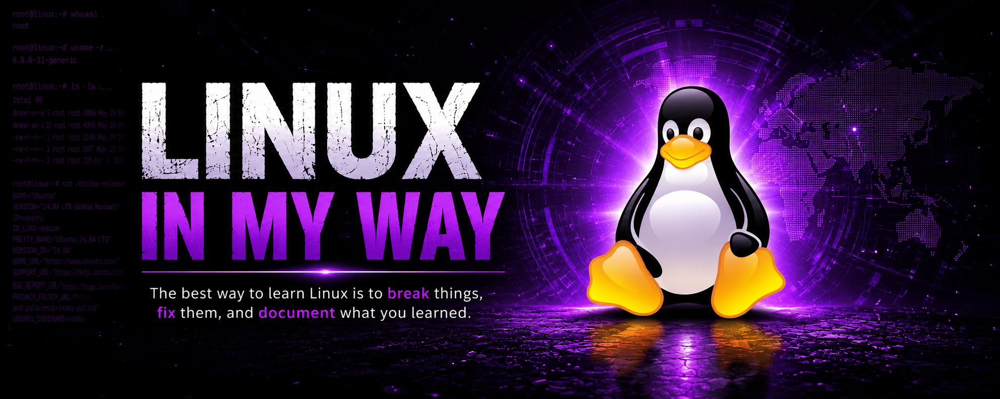

# 🐧 Linux Explained My Way

A personal collection of Linux notes, commands, concepts, troubleshooting steps, and practical examples documented during my learning journey.

This repository is not intended to be an official Linux guide or reference manual. Instead, it contains explanations written in my own words to help reinforce understanding and build long-term knowledge retention.

## Why this repository exists

While learning Linux, I found that simply reading documentation or watching tutorials was not enough. Writing concepts in my own words helped me understand them better and remember them longer.

This repository serves as:

* A personal Linux knowledge base
* A quick reference for commands and concepts
* Documentation of lessons learned from experimentation
* A record of my progress over time
* A foundation for future cybersecurity and penetration testing work

---

## Topics Covered

The repository will gradually include notes on:

* Linux filesystem and directory structure
* File permissions and ownership
* Users and groups
* Package management
* Processes and services
* Shell commands and utilities
* Bash scripting
* Networking fundamentals
* System administration basics
* Logs and monitoring
* SSH and remote administration
* Disk management
* Cron jobs and automation
* Security hardening
* Linux for penetration testing
* Privilege escalation concepts
* CTF and lab notes
* Troubleshooting techniques

---

## Repository Structure

```text
linux-explained-my-way/
│
├── filesystem/
├── permissions/
├── users-and-groups/
├── package-management/
├── networking/
├── processes/
├── bash-scripting/
├── security/
├── privilege-escalation/
├── troubleshooting/
├── cheatsheets/
└── labs/
```

The structure may evolve as my understanding grows.

---

## Philosophy

The notes in this repository prioritize:

* Understanding over memorization
* Practical examples over theory
* Simplicity over complexity
* Learning by doing
* Documenting mistakes and lessons learned

If an explanation seems overly simplified, that is intentional. The goal is to explain concepts in a way that makes sense during the learning process.

---

## Disclaimer

These notes reflect my understanding at the time they were written. Some explanations may be incomplete or evolve as I gain more experience with Linux and cybersecurity.

Learning is iterative, and this repository is intended to grow alongside that journey.

---

## Contributions

This is primarily a personal learning repository, but suggestions, corrections, and discussions are always welcome.

---

## Author

**Junaid**

Cybersecurity enthusiast focused on:

* Linux
* Ethical Hacking
* Penetration Testing
* Red Teaming
* Offensive Security
* Defensive Security

---

## Keep Learning

> "The best way to learn Linux is to break things, fix them, and document what you learned."
